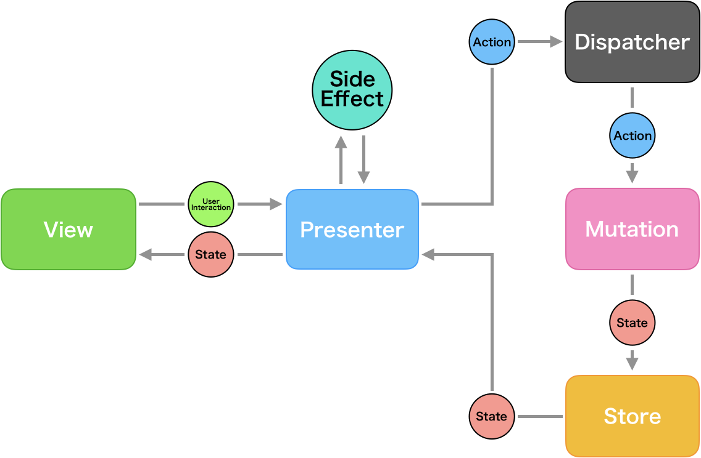
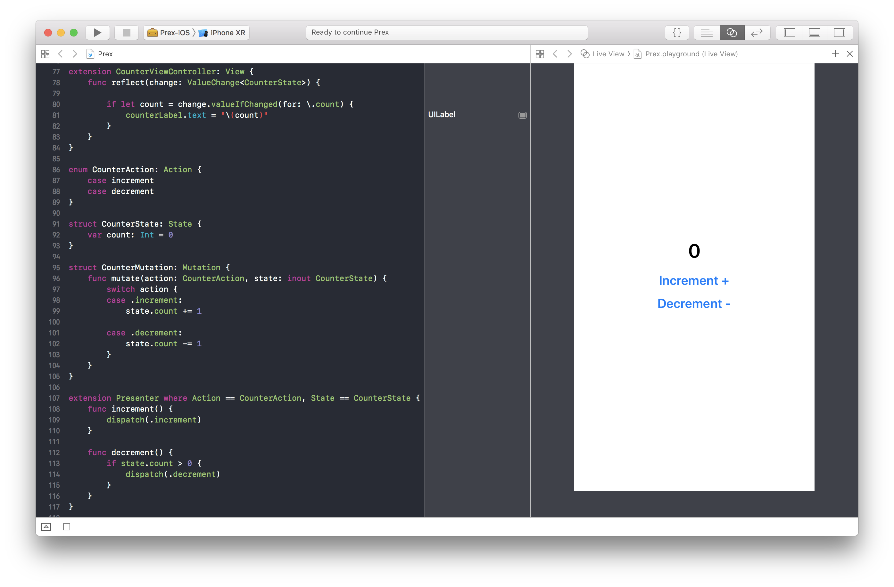

<p align="center">
  
</p>
<p align="center">
  
  <a href="https://developer.apple.com/swift">
    
  </a>
  <a href="https://github.com/Carthage/Carthage">
    
  </a>
  <a href="https://cocoapods.org/pods/Prex">
    
  </a>
  <a href="https://cocoapods.org/pods/Prex">
    
  </a>
  <a href="https://travis-ci.org/marty-suzuki/Prex">
    
  </a>
</p>

Prex is a framework which makes an unidirectional data flow application possible with MVP architecture.

## Concept

Prex represents **Pre**senter + Flu**x**, therefore it is a combination of Flux and MVP architecture.
Data flow is unidirectional that like a below figure.




- [State](#state)
- [Action](#action)
- [Mutation](#mutation)
- [Presenter](#presenter)
- [View](#view)

### State

```swift
struct CounterState: State {
    var count: Int = 0
}
```

### Action

```swift
enum CounterAction: Action {
    case increment
    case decrement
}
```

### Mutation

```swift
struct CounterMutation: Mutation {
    func mutate(action: CounterAction, state: inout CounterState) {
        switch action {
        case .increment:
            state.count += 1

        case .decrement:
            state.count -= 1
        }
    }
}
```

### Presenter

```swift
extension Presenter where Action == CounterAction, State == CounterState {
    func increment() {
        dispatch(.increment)
    }

    func decrement() {
        if state.count > 0 {
            dispatch(.decrement)
        }
    }
}
```

### View

```swift
final class CounterViewController: UIViewController {
    private let counterLabel: UILabel
    private lazy var presenter = Presenter(view: self,
                                           state: CounterState(),
                                           mutation: CounterMutation())

    @objc private func incrementButtonTap(_ button: UIButton) {
        presenter.increment()
    }

    @objc private func decrementButtonTap(_ button: UIButton) {
        presenter.decrement()
    }
}

extension CounterViewController: View {
    func refrect(change: ValueChange<CounterState>) {
        if let count = change.valueIfChanged(for: \.count) {
            counterLabel.text = "\(count)"
        }
    }
}
```

## Advanced

### Share Store

```swift
extension Flux where Action == CounterAction, State == CounterState {
    static let shared = Flux(state: CounterState(), mutation: CounterMutation())
}
```

or

```swift
enum SharedFlux {
    static let counter = Flux(state: CounterState(), mutation: CounterMutation())
}
```

```swift
final class CounterViewController: UIViewController {
    private lazy var presenter = {
        let flux =  Flux<CounterAction, CounterState>.shared
        return Presenter(view: self, flux: flux)
    }()
}
```

### Testing

## Example

### Project

[Example](./Example)

### Playground



## Requirements
- Xcode 9.4.1 or greater
- iOS 10.0 or greater
- tvOS 10.0 or greater
- macOS 10.10 or greater
- watchOS 3.0 or greater
- Swift 4.1 or greater

## Installation

### Carthage

If you’re using [Carthage](https://github.com/Carthage/Carthage), simply add Prex to your `Cartfile`:

```ruby
github "marty-suzuki/Prex"
```

### CocoaPods

Prex is available through [CocoaPods](https://cocoapods.org). To install it, simply add the following line to your Podfile:

```ruby
pod 'Prex'
```

### Swift Package Manager

Prex is available through `Swift Package Manager`. Just add the url of this repository to your `Package.swift`.

```Package.swift
dependencies: [
    .package(url: "https://github.com/marty-suzuki/Prex.git", from: "0.1.0")
]
```

## Inspired by these unidirectional data flow frameworks

- [VueFlux](https://github.com/ra1028/VueFlux) by [@ra1028](https://github.com/ra1028/VueFlux)
- [ReactorKit](https://github.com/ReactorKit/ReactorKit) by [@devxoul](https://github.com/devxoul)

## Author

marty-suzuki, s1180183@gmail.com

## License

Prex is available under the MIT license. See the [LICENSE](./LICENSE) file for more info.
